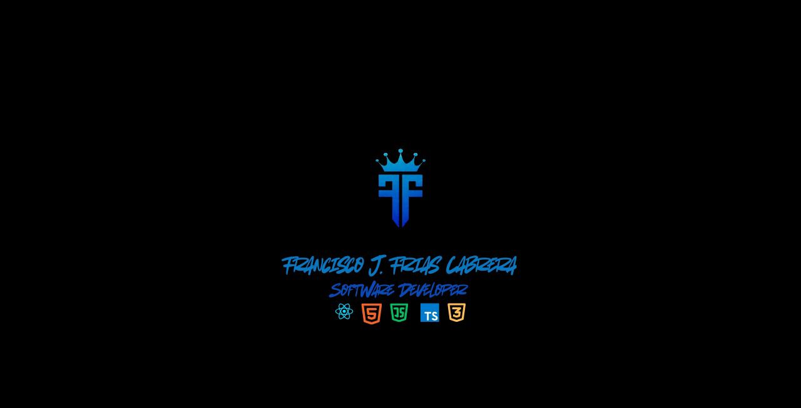

<!-- LOGO -->

  

<h1 align="center"> Francisco J. Frías Cabrera</h1>

  Software Developer Full Stack Web  
  Apasionado por crear aplicaciones modernas, rápidas y escalables

---

## 🚀 Sobre mí

Soy un desarrollador web apasionado por crear soluciones digitales que combinan diseño intuitivo con código robusto. Me gradué del Instituto Tecnológico de las Américas (ITLA), una de las instituciones más prestigiosas de la República Dominicana en el área de tecnología.

Mi experiencia abarca desde el desarrollo frontend con React y Next.js hasta la implementación de backends escalables con Node.js. Me especializo en crear aplicaciones web completas que no solo se ven bien, sino que también funcionan de manera óptima.

Actualmente, me encuentro completando la carrera de Ingeniería de Software, lo que fortalece aún más mi enfoque técnico y mi capacidad para diseñar soluciones escalables y bien estructuradas.

Como Web Master, mantengo una visión holística de los proyectos digitales, asegurando la mejor experiencia de usuario, un rendimiento óptimo y código mantenible.

Me enfoco en:
- Interfaces limpias y funcionales
- Buenas prácticas de desarrollo
- Escalabilidad y rendimiento

---

## 🛠️ Tecnologías

### Frontend
- React / Next.js
- TypeScript / JavaScript
- Tailwind CSS

### Backend
- Node.js
- Express
- PostgreSQL

### Herramientas
- Git & GitHub
- Docker
- Dbeaver
- Cloudflare
- Google WorkSpace
- Windows Server
- Linux Server

---

## 📌 Proyectos Destacados

  

- Portafolio profesional
- Aplicaciones web modernas
- Sistemas con base de datos

---

## 📫 Contacto

  
  
  
  

---

## ⚡ Frase

> "El código limpio siempre parece que fue escrito por alguien que se preocupa."

---

## 📊 Stats

  

